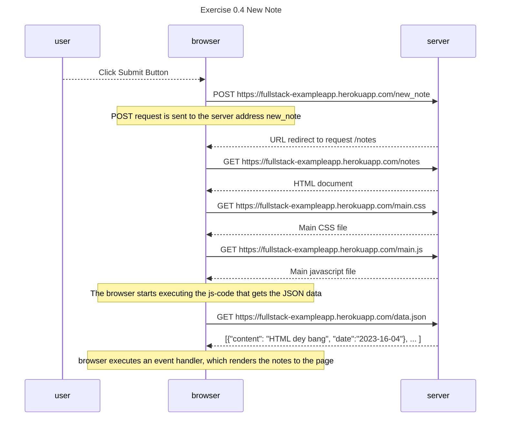

```mermaid
sequenceDiagram
title Exercise 0.4 New Note

participant user
participant browser
participant server

user-->>browser: Click Submit Button
browser->>server: POST https://fullstack-exampleapp.herokuapp.com/new_note
Note over browser: POST request is sent to the server address new_note

server-->>browser: URL redirect to request /notes
browser->>server: GET https://fullstack-exampleapp.herokuapp.com/notes
server-->>browser: HTML document
browser->>server: GET https://fullstack-exampleapp.herokuapp.com/main.css
server-->>browser: Main CSS file
browser->>server: GET https://fullstack-exampleapp.herokuapp.com/main.js
server-->>browser: Main javascript file
note over browser: The browser starts executing the js-code that gets the JSON data

browser->>server: GET https://fullstack-exampleapp.herokuapp.com/data.json
server-->>browser: [{"content": "HTML dey bang", "date":"2023-16-04"}, ... ]
note over browser: browser executes  an event handler, which renders the notes to the page
```
