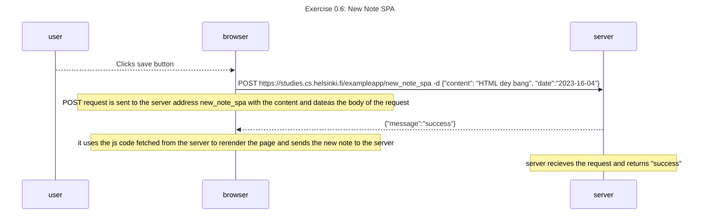

```mermaid
sequenceDiagram
title Exercise 0.6: New Note SPA

participant user
participant browser
participant server

user-->>browser: Clicks save button
browser->>server: POST https://studies.cs.helsinki.fi/exampleapp/new_note_spa -d {"content": "HTML dey bang", "date":"2023-16-04"}

note over browser: POST request is sent to the server address new_note_spa with the content and dateas the body of the request
 

server-->>browser: {"message":"success"}

note over browser: it uses the js code fetched from the server to rerender the page and sends the new note to the server

note over server: server recieves the request and returns "success" 

```